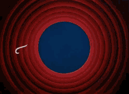

<style>

.remark-slide-number {
  position: inherit;
}

.remark-slide-number .progress-bar-container {
  position: absolute;
  bottom: 0;
  height: 6px;
  display: block;
  left: 0;
  right: 0;
}

.remark-slide-number .progress-bar {
  height: 100%;
  background-color: #0f4c81;
}

.orange {
  color: #EB811B;
}
</style>

# Estrutura

- Introdução

--

- Business understanding

--

- Web scrapping

--

- Data preparation

--

- Data analysis
  
  . Regressão linear múltipla
  
  . Redes neuronais
  
  . Árvores de decisão
  
--

- Avaliação dos resultados

---

# Introdução

## Objetivo

**A prever os preços dos hotéis em Paris na estadia de uma noite de dia 16 para 17 de abril de 2021 (utilizando o CRISP-DM).**

--

1. análise do setor turismo de uma forma geral e mais detalhada para a cidade de Paris.

--

2. análise dos dados em questão, nomeadamente quais as variáveis que podem influenciar o problema.

--

3. data preparation: web scrapping e limpeza de dados.

--

4. redes neuronais e  modelos de previsão,  nomeadamente usando a  regressão linear múltipla e  árvores de decisão.

--

5. valiação dos modelos criados e seus  resultados, apresentando as  limitações que surgiram em fases anteriores


---

# Business Understanding

Nos últmos anos assistimos a um aumento de canais de venda online , o que mudou a natureza das reservas de viagens. Estas agências foram responsaveis por mais de um quarto das reservas na Europa, sendo o Booking.com a maior no mercado, com uma  participação de mercado de 67,7%.

--

A teoria de preços hedónicos (Lancaster, 1966; Rosen, 1974) diz que o preço de um  produto pode ser considerado uma função das  suas características que afetam a utilidade  para o consumidor. Cada vez mais existem modelos hedônicos aplicados a vários bens de consumo, nomeadamente na indústria de habitação e hotelaria.


--


Existem vários fatores económicos determinantes  para a escolha de um quarto. O objetivo do hotel, ao  determinar os preços dos quartos é atingir um  equilíbrio para maximizar o lucro:

- Preços mais altos para atrair consumidores de luxo
- Preços mais baixos para atrair consumidores "normais"

---

# Business Understanding

De acordo com a teoria de preços hedonicos, qualquer característica única, ou combinação de características, que sejam fortemente significativas para pelo menos um conjunto de consumidores podem ser usadas como base para determinação dos preços de um hotel:
- a localização do hotel,
- tipo de quarto,
- restaurantes perto do hotel,
- a reputação do estabelecimento,
- os níveis de limpeza e  segurança
- ...

--

De facto, a segurança é uma das principais prioridades quando os turistas reservam as suas viagens, logo o terrorismo e as crises epidêmicas têm um efeito bastante negativo sob preço.

--

A sazonalidade também é um fator bastante importante no que toca a oscilações de preços, assim como a diferença entre dias de semana e fins de semana, feriados e dias "especiais". Para a além das épocas de saldos e dias como a Black Friday onde se verifica uma grande redução dos preços.


---

# Business Understanding

## Paris

A  capital francesa encontra-se	entre os destinos mais visitados da Europa, com turistas internacionais a gastar mais de 10 bilhões de dólares por ano.

--

Em 2016, este setor contribuiu com 198,3 bilhões de euros para a  economia francesa e criou 2,8 bilhões de empregos, direta e indiretamente.

--

Em 2018, França contou com um total de 89,4 milhões de visitantes  (aumentou 3% em relação a 2017), sendo que Paris teve mais de 40 milhões  de visitantes. Em 2018 o país tinha como meta, 100 milhões de turistas  estrangeiros  em 2020.

---

# Business Understanding

## Paris

Com todas as consequências e restrições que o covid19 trouxe, esta meta não foi alcançada. Depois de uma primavera bastante dolorosa, o país “recuperou” no verão graças a uma queda no número de turistas menor do que o esperado, ainda que o período foi marcado pela ausência de turistas internacionais.

--

De acordo com um relatório da ADN Tourisme, apenas 53% dos residentes franceses foram de férias de verão, em comparação com 71% em 2019. Mas 94% dos que viajaram foi dentro do próprio país, dando um impulso ao setor do turismo. O estudo constatou que os turistas franceses optam cada vez mais por casas de aluguer de temporada, que oferecem maior privacidade e parecem mais seguras em termos de saneamento do que hotéis e acampamentos com instalações compartilhadas.

---

# Data Understanding

Como o período em causa é tão  invulgar serão apenas analisados dados  atuais, não tendo em conta dados  temporais como a sazonalidade.

Os dados utilizados para a realização  deste modelo são retirados do site da  booking.com. Uma vez que este não é o  site oficial de cada hotel, podem existir  descontos e promoções oferecidas  exclusivamente nesta plataforma.

A informação corresponde a uma  estadia normal de uma noite para duas  pessoas.

Foi utilizado um conjunto de dados que  consiste no preço de cada hotel em  Paris e uma série de características.

---

# Data Understanding

Preditores potenciais:

- classificação de estrelas

- distância ao centro da cidade (km)

- score médio das reviews

- número de reviews

- número de quartos restantes

- pequeno-almoço incluído no preço

- cancelamento gratuito


---

# Data Understanding

Um estudo feito sobre os preços de  quartos de hotel em Paris, baseado na abordagem hedónica de preços  (Meahan, 2016), mostrou que a  classificação por estrelas e a  classificação do hotel desempenhavam  um papel fundamental na determinação  dos preços dos quartos, ou seja, quanto  maior estes atributos, maior será o  preço do quarto.

--

O estudo também mostrou que hotéis  mais afastados do centro de Paris estão  associados a preços mais baixos e que o  pequeno almoço incluído aumenta o  preço dos hotéis.

--

Para além disso, as avaliações dos  usuários online têm impactos positivos  nos preços dos hotéis (Wang, X., Sun,  J., & Wen, H. 2019).

--

Em relação às características “restam x quartos para reserva” e “cancelamento gratuito”, não foram encontrados nenhuns estudos relativos ao impacto destas, o que pode ser explicado por serem características do site e não do hotel em si.

---

# Web Scraping

```{r echo=F}
df <- readRDS(file = "~/MSc in Data Science/DSMT/df_all.rds")
```

```{r eval =F}
#carregar pacote para fazer o webscraping
if (!require("pacman")) install.packages("pacman")
pacman::p_load(rvest, stringr, readr, dplyr, caret,tidyr,dplyr,plyr,
              corrplot,neuralnet,MLmetrics,partykit,rpart,rpart.plot,ranger,gbm)

*city_code_booking <- "-1456928" #Paris

{{"dia checkin"}}
checkin_day <- 16
checkin_month <- 4
checkin_year <- 2021
{{"dia checkout"}}
checkout_day <- 17
checkout_month <- 4
checkout_year <- 2021
```

Extração dos dados em tranches de 25 observações, sendo que se utilizou a ordem crecente de distância ao centro (i.e. <kbd>order=distance_from_search</kbd>) sendo que é um indicador que manterá a ordem das observações mais estável (ao contrário de outras variáveis dinâmicas como o preço).

---

# Web Scraping

Estratégia:

- inspeção do URL

- inspeção do HTML de uma página de resultados

- seleção dos elementos a extrair

- produção do código de extração:

  - obter o total de acomodações total (`> 1000`)
  - obter o total de acomodações por nível de classificação
  - ciclos de extração por nível de classificação
  - o mesmo processo para o tipo de propriedade (hotel vs. apartamento)
  - fundir bases numa só (i.e. `df.rds`)

---

# Web Scraping

## Inspeção do URL

Forma genérica:

```{r echo=F, warning=FALSE,message=F}
if (!require("pacman")) install.packages("pacman")
pacman::p_load(rvest, stringr, readr, dplyr, caret,tidyr,dplyr,plyr,
              corrplot,neuralnet,MLmetrics,partykit,rpart,rpart.plot,ranger,gbm)

city_code_booking <- "-1456928" #Paris

checkin_day <- 16
checkin_month <- 4
checkin_year <- 2021
checkout_day <- 17
checkout_month <- 4
checkout_year <- 2021
i <- 0
```


```{r}
url <- paste0(
  "https://www.booking.com/searchresults.html?checkin_month=",checkin_month,
  "&checkin_monthday=",checkin_day,
  "&checkin_year=",checkin_year,
  "&checkout_month=",checkout_month,
  "&checkout_monthday=",checkout_day,
  "&checkout_year=",checkout_year,
  "&city=",city_code_booking,
  "&group_adults=2&nflt=class%3D",i,"%3B",
  "&order=distance_from_search")
```

---

# Web scraping

Uso da ferramenta `Selector Gadget` (extensão Google Chrome):

</img>


---

# Web Scraping

## Inspeção do HTML

Forma genérica das nodes a extrair:

```{r eval =F}
page <- url %>% read_html()

elem_list <- page %>%
  html_nodes(
    ".sr_room_reinforcement:nth-child(1),
    .sr_rooms_left_wrap,
    .e2e-free-cancellation,
    .sr_card_address_line :nth-child(3),
    .bui-price-display__value,
    .bui-review-score__badge,
    .bui-review-score__text,
    .sr-hotel__name,
    .bui-rating--smaller
    .bui-review-score__title
    .sr-hotel__title-badges")
```

---

# Web Scraping

## Inspeção do HTML

```{r}

```


---

# Web Scraping

---

# Data Preparation


Total 1814 hospedagens (hotéis + propriedades), 16/04/2021-17/04/2021;

`summary(df)`

Remoção de duplicados .orange[(60)]

`dupl_hotels <- data.frame(df[duplicated(df$hotel_name),]$hotel_name)`

`Print(dupl_hotels)`

`df %>% distinct(hotel_name, .keep_all = TRUE)`
  
Conversão variáveis categóricas para escala `[0:1]`

Pequeno almoço, cancelamento gratuito, quartos disponíveis *

Identificação de Outliers – `price_eur`

---

# Data Preparation

Total de 114 hospedagens removidas com base neste critério

Eliminação das hospedagens  para dados `NA`

Pequeno almoço, score, n reviews e pequeno almoço;

Ex.: `df_temp[!is.na(df_temp$dist_center_km == "NA"),]`


</img>

---

# Data Preparation

- Str/Correlação:

```{r echo=FALSE}
str(df)
```
---

# Data Preparation

</img>

---

# Data Preparation

</img>


---

# Data Preparation

</img>

---

# Data Preparation

</img>

- Base ao final da etapa de pré-processamento: **1556** propriedades

---

# Regressão Linear Múltipla

- Aprendizagem supervisionada – RLM
  - RLS descartada pela baixa correlação entre a variável alvo e as preditoras;

--

- Dois tipos diferentes: maior R2, comparação, 
  - RLM-ALL: todas variáveis preditoras
  - RLM-4: quatro variáveis preditoras com maior variância

--

- Definição dos conjuntos de treino (75%) e de teste  (25%)

---

# Regressão Linear Múltipla

| Variáveis preditoras  | Modelo 1 | Modelo 2 |
|-----------------------|----------|----------|
| Distância ao centro   | ✔        | ✔        |
| Score                 | ✔        | ✔        |
| Nº reviews            | ✔        | ✔        |
| Pequeno-almoço        | ✔        | ❌        |
| Cancelamento gratuito | ✔        | ❌        |
| Quartos disponíveis   | ✔        | ❌        |
| Nº estrelas           | ✔        | ✔        |

---

# Regressão Linear Múltipla

Todas as preditoras a serem utilizadas (`RLM-ALL`)

`model_mult1 <- lm(formula = price_eur ~ ., data = train_1)`

Conjunto treino (75%): 

$R^2 = 0.27$ 

$RMSE = 58.511$

$MSE = 3423.595$ 

$MAE = 1.881348e-15$

Conjunto teste (25%): 

$RMSE = 56.598$ 

$MSE = 3203.279$ 

$MAE = 44.448$

---

# Regressão Linear Múltipla

</img>

---

# Regressão Linear Múltipla

</img>

---

# Regressão Linear Múltipla

Quatro v.i.'s (`RLM-4`)

`model_mult2 <- lm(formula = price_eur ~ dist_center_km + score + n_reviews + n_stars, data = train_1)`

Conjunto treino (75%): 

$R^2 = 0.25$

$RMSE = 59.293$

$MSE = 3515.605$ 

$MAE = 1.509168e-15$


Conjunto teste (25%): 

$RMSE = 56.969$

$MSE = 3245.506$

$MAE = 44.841$

---

# Regressão Linear Múltipla

</img>

---

# Regressão Linear Múltipla

</img>

---

# Redes Neuronais

- NN: Normalização dos dados escala [0:1];

`function(x){(x-min(x))/(max(x)-min(x))}`

- Modelo proposto:

  - 8 variáveis preditoras;

  - Função de ativação logística (act.fct);

  - Função para o cálculo do erro (err.fct) definida pelo desvio padrão do erro (sse);

  - 12 neurónios;

- Conjunto treino (75%) e teste (25%)

---

# Redes Neuronais

</img>


---

# Redes Neuronais

</img>

---

# Árvores de Decisão

Para uma segunda análise, foi criado um modelo de árvore de decisão para prever o preço do hotel, com base nas variáveis preditoras, score, distância ao centro da cidade, se o pequeno  almoço é incluído, número de estrelas, número  de reviews, número de quartos restantes no hotel e se o cancelamento é gratuito, considerando conjuntos Treino (25%) e Teste  (75%).

A árvore definiu como principal variável  explicativa dos preços dos hotéis a variável  número de estrelas.

</img>

---


# Árvores de Decisão


</img>


---

# Árvores de Decisão

## Poda

</img>

</img>

---

# Árvores de Decisão

## Validação cruzada

</img>


---

# Árvores de Decisão

## Importância das variáveis

</img>

---

# Árvores de Decisão: Bagging

</img>

---

# Árvores de Decisão: Bagging

## Importância das variáveis

</img>


---

# Árvores de Decisão: Florestas Aleatórias

</img>

---

# Árvores de Decisão: Florestas Aleatórias

## Importância das variáveis

</img>

---

# Árvores de Decisão: Boosting

</img>

---

# Árvores de Decisão: Boosting

## Importância das variáveis

</img>


---

# Investigação atual

```{r xaringan-panelset, echo=FALSE, message=F,warning=F}
xaringanExtra::use_panelset()
xaringanExtra::style_panelset(panel_tab_color_active = "red")
```

.panelset[
.panel[.panel-name[R Code]

```{r panel-chunk, fig.show='hide', fig.align = "center", fig.dim=c(5, 3),fig.retina=3, out.width="100%", message=F,warning=F}
pacman::p_load(ggstatsplot,magrittr)
df <- readRDS("~/MSc in Data Science/DSMT/df_all.rds")
reg_m <- lm(formula = price_eur ~ dist_center_km + score + n_reviews + breakfast + free_cancelation + n_rooms_left + n_stars,data = df)
ggcoefstats(x = reg_m)
```
]

.panel[.panel-name[Output]
.center[
`)
]
]

.panel[.panel-name[Análise Estatística]
```{r xaringan-tachyons_t_test_stat_analysis, echo=FALSE, message=F,warning=F}
xaringanExtra::use_tachyons()
```

.bg-washed-green.b--dark-green.ba.bw2.br3.shadow-5.ph4.mt5[

Modelos preditivos.

]

.panel[.panel-name[Resultados]
```{r xaringan-tachyons_t_test_results, echo=FALSE, message=F,warning=F}
xaringanExtra::use_tachyons()
```


.tr[`r emo::ji("scroll")` refs... ]

]]]

---

# Avaliação dos resultados

- Detalhamento das informações extraídas a partir do scraping e, eventualmente, a obtenção de variáveis preditoras;

--

- Satisfatória aplicação da aprendizagem supervisionada:

--

  - RLM-ALL x RLM-4: baixa explicação da variabilidade dos preços, ruído, proximidade com âlguns parâmetros da BD final;
  - Insuficiente para tartar valores extremos, valores negativos no mínimo; 

</img>

---

# Avaliação dos resultados

- Promissora utilização das Redes Neuronais (NN):

  - Limitações téoricas;
  - Resultados mais robusto e melhor integração das variáveis preditoras;


--


- Modelo Árvore de Decisão – Florestas Aleatórias: 
  - Fácil visualização
  - Panorama de preços dos hotéis
  - Margem de erro de 38.90 EUR
  
</img>


---

# Avaliação dos resultados

- Influência dos preços das propriedades no conjunto de dados. A segmentação poderá ser precisa em novos estudos.

  - Técnicas supervisionadas ou não supervisionadas, para a identificação e classificação (tipo de propriedade) consoante as mesmas variáveis obtidas.

- Impacto causado pela crise do COVID-19 na economia de forma geral e, em especial, no setor do turismo.
  - Incerteza e instabilidade dos preços. 
  - Possibilidade de restrições

- Importância do fator sazonalidade nas oscilações dos preços no setor do turismo / Dados longitudinais;


```{r setup, include=FALSE}
options(htmltools.dir.version = FALSE)
options(knitr.table.format = "html")
knitr::opts_chunk$set(fig.retina=2, out.width="100%", warning = FALSE, message = FALSE)
```


```{r xaringan-logo, echo=FALSE}
xaringanExtra::use_logo(image_url = "img/ibs_logo.png", width = "80px")
```


```{r xaringan-tile-view, echo=FALSE}
#overview
xaringanExtra::use_tile_view()
```

---

class: center, bottom, inverse

# Mais info

--

Slides criados através do pacote _R_ [`xaringan`](https://github.com/yihui/xaringan).

--

Ana Sucena

--

Felipe Amaral

--

Jorge Sinval

--

.

--

_In God we trust, all others bring data_

--

Edwards Deming

--

.

--

.

--

.

--

THE END

---
class: center, bottom, inverse


